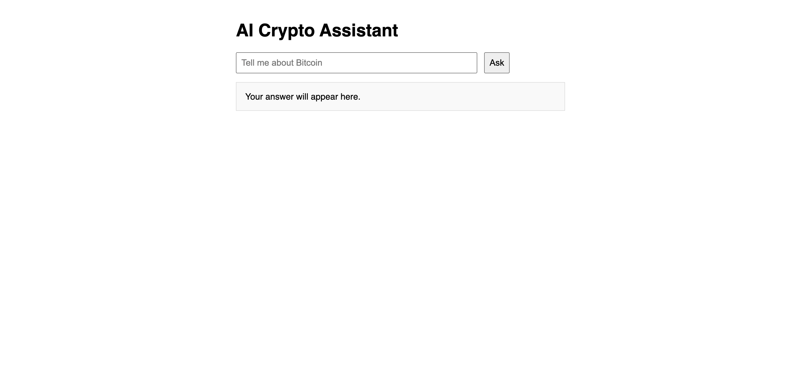
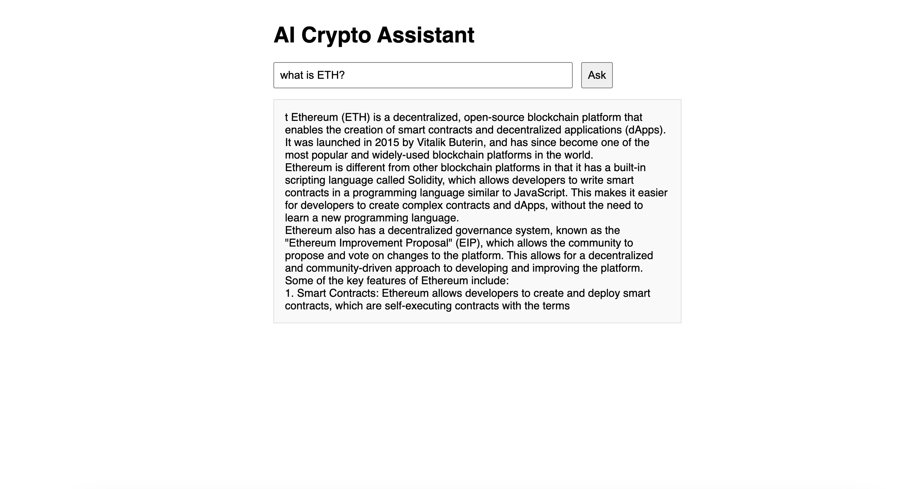

# 🚀 AI Crypto Assistant using Off-Chain Data Sources

This project spins up a small FastAPI/HTML app that answers user questions about the crypto market by pulling live data from:

1. **A Crypto News Service** (e.g. newsapi.org)  
2. **A Crypto Exchange API** (CoinGecko) for price  
3. **A Market Data API** (CoinGecko) for market cap & ranking  

---

## 📦 Usage

### 1. Install dependencies

```bash
pip install -r requirements.txt
```

Your requirements.txt should include, at minimum:

```bash
fastapi
uvicorn[standard]
httpx
python-dotenv
starlette
llama-cpp-python        # if you’re running a local GGUF model
transformers            # if you’re using the HuggingFace pipeline
```

## 2. Create .env
```
OPENAI_API_KEY=YOUR_FULL_API_KEY
```

## 3. Run the App
```bash
# .env
# — Crypto APIs —
NEWS_API_KEY=your_newsapi_key_here

# — Model Configuration (choose one) —
# If using OpenAI:
OPENAI_API_KEY=your_openai_key_here

# If using HuggingFace inference:
HF_ACCESS_TOKEN=your_hf_token_here

# If using a local llama‐cpp model:
MODEL_PATH=/absolute/path/to/your/model.gguf
```

Once the server starts, open your browser at the URL shown (usually http://localhost:8000).

## 4. Use the App

1. Write a query.

2. Submit prompt.

3. Wait for the app to display messages.

4. The app will display an answer.

## 🧾 Example Output
```bash
What is Bitcoin?

Bitcoin is a decentralized digital currency that allows for peer-to-peer transactions without the need for intermediaries like banks or governments. It was created in 2009 by an anonymous individual or group...
```

## 🖼️ Demo Screenshot
### Main page


### Result


## 📁 Project Structure

```
📦Assignment4/
ai-crypto-assistant/
├── .env                      # your API keys & config
├── run_local.sh             # helper script to launch uvicorn
├── requirements.txt         # pip dependencies
└── src/
    ├── main.py              # FastAPI app + `/api/chat` endpoint
    ├── ai_client.py         # LLM client (OpenAI / HF / llama-cpp)
    ├── services/
    │   ├── exchange_service.py   # fetch live prices
    │   ├── market_service.py     # fetch market cap & rank
    │   └── news_service.py       # fetch latest headlines
    └── static/
        └── index.html       # simple HTML + JS front-end
```